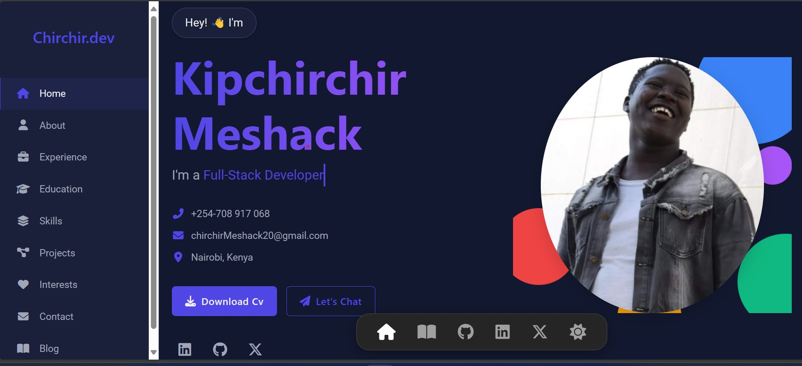

# Kipchirchir Kimoloi - Personal Portfolio Website



## Introduction

This repository contains the source code for the personal portfolio website of Kipchirchir Meshack Kimoloi. The website showcases his skills, experience, education, projects, and interests as an ICT Engineer and Full-Stack Developer. It features a clean, responsive design with interactive elements and a dark/light theme toggle.

**Live Demo:** [https://kipchirchirmeshack.netlify.app/](https://kipchirchirmeshack.netlify.app/)

## Features

* **Responsive Design:** Adapts seamlessly to various screen sizes (desktops, tablets, mobiles).
* **Interactive UI:** Smooth animations (using AOS library), typing effect for the subtitle, and interactive navigation elements.
* **Multiple Sections:** Includes sections for Home (Hero), About Me, Work Experience, Education, Skills (Stack), Projects, Interests, and Contact.
* **Detailed Project Showcase:** Dedicated pages for project details (e.g., Washlytics, Portfolio itself).
* **Dynamic Content:** JavaScript is used for theme switching, sidebar management, active link highlighting, form handling, and dynamic copyright year.
* **Theme Toggle:** Switch between light and dark modes, with preference saved in local storage.
* **Navigation:** Responsive sidebar (full, icon-only, or hidden with hamburger menu) and a fixed bottom navigation bar for easy access.
* **Contact Form:** Integrated with Formspree for easy message sending, including a thank-you page.
* **Blog Placeholder:** A dedicated page ready for future blog content.

## Technologies Used

* **Frontend:**
  * HTML5
  * CSS3 (including CSS Variables, Flexbox, Grid)
  * JavaScript (ES6+)
* **Libraries/Frameworks:**
  * [Font Awesome](https://fontawesome.com/) (for icons)
  * [AOS (Animate On Scroll Library)](https://michalsnik.github.io/aos/) (for scroll animations)
  * [Devicon](https://devicon.dev/) (for technology icons)
* **Tools:**
  * [Formspree](https://formspree.io/) (for contact form backend)
  * Git & GitHub (for version control)
* **Deployment:**
  * Netlify (example link provided)

## Setup & Installation

This is a static website project. To view or run it locally:

1. **Clone the repository:**

    ```bash
    git clone [https://github.com/ChirchirMeshack/HackathonPortfolio.git](https://github.com/ChirchirMeshack/HackathonPortfolio.git)
    ```

2. **Navigate to the project directory:**

    ```bash
    cd HackathonPortfolio
    ```

3. **Open `index.html` in your browser:**
    Simply double-click the `index.html` file or use a live server extension (like Live Server in VS Code) to view the website.

## Code Snippets & Explanations

Here are some key parts of the code:

### 1. Theme Toggle Logic (`js/script.js`)

This function handles switching between dark and light modes and saves the user's preference.

```javascript
// --- 2. Theme Toggle (Dark/Light Mode) ---
function applyTheme(isDark) {
    const darkModeIcon = darkModeToggle ? darkModeToggle.querySelector('i') : null;
    if (isDark) {
        body.classList.add('dark-mode');
        if (darkModeIcon) darkModeIcon.classList.replace('fa-moon', 'fa-sun');
    } else {
        body.classList.remove('dark-mode');
        if (darkModeIcon) darkModeIcon.classList.replace('fa-sun', 'fa-moon');
    }
}

function setupTheme() {
    const savedTheme = localStorage.getItem('portfolioTheme');
    // Check saved theme OR system preference
    let isDarkMode = savedTheme !== null
        ? savedTheme === 'dark'
        : window.matchMedia('(prefers-color-scheme: dark)').matches;

    applyTheme(isDarkMode); // Apply theme on load

    if (darkModeToggle) {
        darkModeToggle.addEventListener('click', () => {
            const currentlyDark = body.classList.contains('dark-mode');
            applyTheme(!currentlyDark);
            // Save preference to localStorage
            localStorage.setItem('portfolioTheme', !currentlyDark ? 'dark' : 'light');
        });
    }
}
setupTheme();
```

**Explanation:**  
It checks `localStorage` for a saved theme. If none exists, it defaults to the user's OS preference. Clicking the toggle button updates the body class, changes the icon, and saves the new preference.

### 2. Responsive Sidebar Logic (`js/script.js` & `css/style.css`)

JavaScript determines the sidebar state based on screen width, adding classes to the body and sidebar. CSS handles the visual transitions and layout adjustments.

**JavaScript (`js/script.js`):**

```javascript
// --- 9. Screen Size Check & Layout Adjustment ---
function checkScreenSizeAndApplyLayout() {
    let sidebarWidthPx = 0; // Default padding

    if (window.innerWidth >= 1200) { // Full Sidebar
        sidebarWidthPx = sidebar ? parseInt(getComputedStyle(document.documentElement).getPropertyValue('--sidebar-width-lg'), 10) : 250;
        body.classList.add('sidebar-visible');
        body.classList.remove('sidebar-icon-only');
        if (sidebar) sidebar.classList.remove('icon-mode');
    } else if (window.innerWidth >= 993) { // Icon-Only Sidebar
        sidebarWidthPx = sidebar ? parseInt(getComputedStyle(document.documentElement).getPropertyValue('--sidebar-width-icon'), 10) : 80;
        body.classList.add('sidebar-visible');
        body.classList.add('sidebar-icon-only');
        if (sidebar) sidebar.classList.add('icon-mode');
    } else { // Hamburger Menu (No fixed sidebar)
        sidebarWidthPx = 0;
        body.classList.remove('sidebar-visible');
        body.classList.remove('sidebar-icon-only');
        if (sidebar) sidebar.classList.remove('icon-mode');
        // Ensure menu is closed if resizing down
        if (sidebar && sidebar.classList.contains('open')) {
            closeMenu();
        }
    }
    // Apply padding to body
    body.style.paddingLeft = `${sidebarWidthPx}px`;
    // Adjust bottom nav position (example)
    // ... bottom nav positioning logic ...
}
checkScreenSizeAndApplyLayout(); // Initial Check
window.addEventListener('resize', () => { /* Debounced call to checkScreenSizeAndApplyLayout */ });
```

**CSS (`css/style.css`):**

```css
/* --- Sidebar --- */
#sidebar {
    /* ... base styles ... */
    width: var(--sidebar-width-lg); /* Full width by default */
    transform: translateX(-100%); /* Hidden on small screens */
    transition: transform 0.4s ease-in-out, width 0.4s ease-in-out /* ... other transitions */;
}

/* Styles for icon-only mode triggered by JS class */
@media (min-width: 993px) and (max-width: 1199px) {
    #sidebar {
        width: var(--sidebar-width-icon);
        transform: translateX(0);
    }
    #sidebar h2, #sidebar nav ul li a.nav-link span {
        opacity: 0; /* Hide text */
    }
    /* ... other icon-only styles ... */
}

/* Styles for full sidebar mode */
@media (min-width: 1200px) {
    #sidebar {
        width: var(--sidebar-width-lg);
        transform: translateX(0);
    }
    #sidebar h2, #sidebar nav ul li a.nav-link span {
        opacity: 1; /* Show text */
    }
    /* ... other full sidebar styles ... */
}
```

**Explanation:**  
JavaScript dynamically calculates the required body padding based on the visible sidebar width (full, icon-only, or none) and applies it. CSS variables (`--sidebar-width-lg`, `--sidebar-width-icon`) define the widths, and media queries combined with JS-applied classes control the sidebar's appearance and the main content's padding.

### 3. Typing Effect (`js/script.js`)

This creates the animated typing effect in the hero section subtitle.

```javascript
// --- 5. Typing Effect ---
function setupTypingEffect() {
    if (!typingElement) return;
    const config = {
        words: JSON.parse(typingElement.getAttribute('data-words') || '[]'),
        typeSpeed: 120, // Speed of typing
        deleteSpeed: 70, // Speed of deleting
        delayAfterType: 1500, // Pause after typing word
        // ... other config options ...
    };
    // ... logic to cycle through words, type/delete characters ...
    function type() {
        // ... handles typing/deleting logic ...
        typingElement.textContent = currentWord;
        // ... calculates next timeout ...
        setTimeout(type, typeSpeed);
    }
    setTimeout(type, 1000); // Start effect
}
setupTypingEffect();
```

**Explanation:**  
The function reads words from the `data-words` attribute on the HTML element. It then simulates typing and deleting characters one by one, cycling through the provided list of words with configurable speeds and delays.

## Screenshots

**Hero Section (Desktop):**  


**Skills Section (Dark Mode):**  


**Projects Section:**  


**Responsive View (Mobile):**  


## Contact

**Name:** Meshack Kipchirchir Kimoloi  
**Email:** <chirchirMeshack20@gmail.com>  
**Phone:** +254-708 917 068  
**Location:** Nairobi, Kenya  
**GitHub:** [github.com/ChirchirMeshack](https://github.com/ChirchirMeshack)  
**LinkedIn:** [linkedin.com/in/meshack-kipchirchir-5201252a9/](https://linkedin.com/in/meshack-kipchirchir-5201252a9/)
